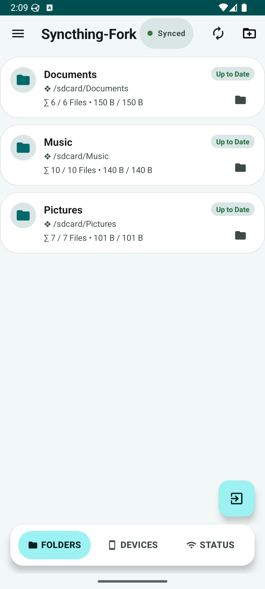
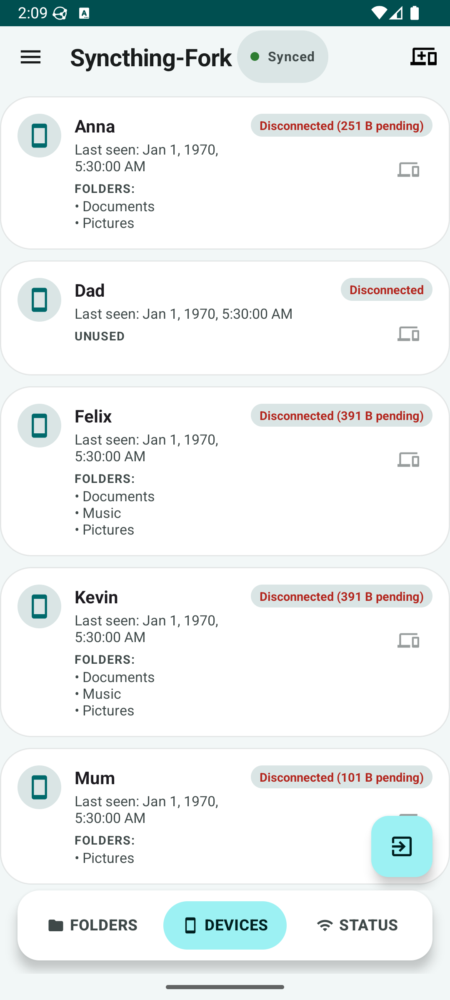
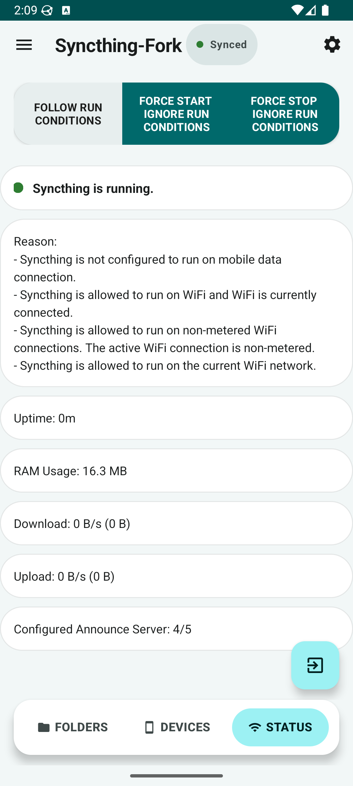

# Syncthing-Fork Redesign - A Syncthing Wrapper for Android

A wrapper of [Syncthing](https://github.com/syncthing/syncthing) for Android, with a Material 3 Expressive interface redesign. Head to the "releases" section for builds. Please seek help on the forum and/or social media apps first before creating issues on the tracker.

 ·  · 

## Switching from the deprecated official version

Switching is easier than you may think! See our [wiki article](wiki/migration/Switching-from-the-deprecated-official-version.md) for detailed instructions.

## Wiki and Useful Articles

Our knowledge base is published [here](wiki#readme).

## Building and Development Notes

See [detailed info](wiki/developers/Building-and-Development.md).

## Acknowledgments

This project is a fork of [syncthing/syncthing-android](https://github.com/syncthing/syncthing-android), which is in turn a continuation of [Catfriend1/syncthing-android](https://github.com/Catfriend1/syncthing-android) and the [Syncthing-Fork](https://github.com/researchxxl/syncthing-android) project. The redesign in this repository builds directly on that lineage.

Special thanks to the former maintainers and contributors, without whom none of this would exist:

- [Catfriend1](https://github.com/Catfriend1) - created and maintained the Syncthing-Fork app for many years
- [researchxxl](https://github.com/researchxxl) - current maintainer of Syncthing-Fork, from which this redesign descends
- [imsodin](https://github.com/imsodin) - former maintainer of syncthing-android
- [nutomic](https://github.com/nutomic) (Felix Ableitner) - author of syncthing-android
- [zillode](https://github.com/zillode) (Lode Hoste) - long-time Syncthing Android contributor
- [André Colomb](https://github.com/AndreColomb) - translations and tooling
- [Audrius Butkevicius](https://github.com/audriusb) - Syncthing Android contributions
- [George Venios](https://github.com/GeorgeVenios) - Syncthing Android contributions
- The [Syncthing](https://github.com/syncthing/syncthing) project itself, and everyone who has filed issues, sent patches, or translated the app

Thanks also to the Material 3 Expressive guidance that shaped the redesign, and to everyone who has reported bugs against these builds.

## Privacy Policy

See our document on privacy: [privacy-policy.md](privacy-policy.md).

## License

The project is licensed under [MPLv2](LICENSE).

## Third-party Community Projects

They extend use cases of our app or depend on our app. You might be curious to check their readme.

- [SleepSync](https://github.com/Baggio94/SleepSync) - "Pause Syncthing-Fork when your Android device sleeps and automatically resume it when the screen wakes."
